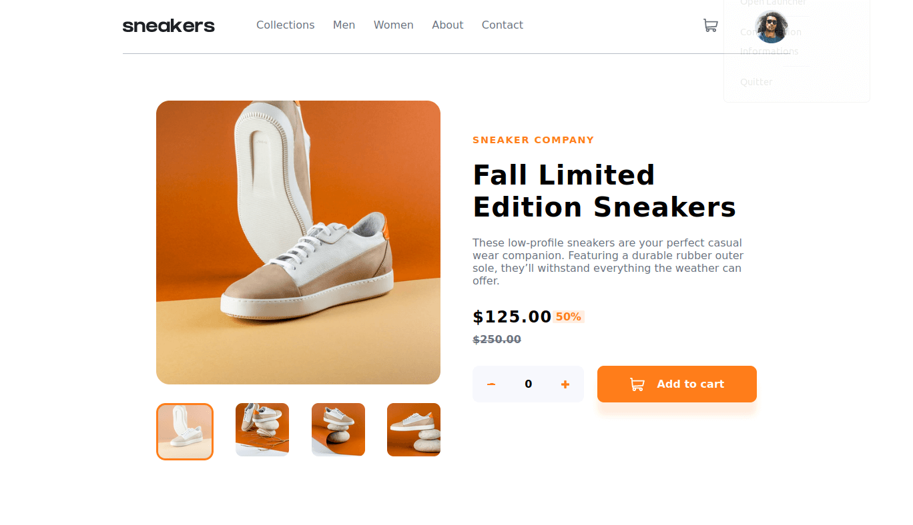

# Frontend Mentor - E-commerce product page solution

This is a solution to the [E-commerce product page challenge on Frontend Mentor](https://www.frontendmentor.io/challenges/ecommerce-product-page-UPsZ9MJp6). Frontend Mentor challenges help you improve your coding skills by building realistic projects.

## Table of contents

- [Overview](#overview)
  - [The challenge](#the-challenge)
  - [Screenshot](#screenshot)
  - [Links](#links)
- [My process](#my-process)
  - [Built with](#built-with)
  - [What I learned](#what-i-learned)
  - [Continued development](#continued-development)
  - [Useful resources](#useful-resources)
- [Author](#author)
- [Acknowledgments](#acknowledgments)

**Note: Delete this note and update the table of contents based on what sections you keep.**

## Overview

### The challenge

Users should be able to:

- View the optimal layout for the site depending on their device's screen size
- See hover states for all interactive elements on the page
- Open a lightbox gallery by clicking on the large product image
- Switch the large product image by clicking on the small thumbnail images
- Add items to the cart
- View the cart and remove items from it

### Screenshot

### Links

- Solution URL: [https://github.com/rochelin-shikamaru/E-commerce-product-page](https://your-solution-url.com)
- Live Site URL: [https://e-co-page.netlify.app](https://your-live-site-url.com)

## My process

### Built with

- Semantic HTML5 markup
- Scss
- CSS custom properties
- Flexbox
- CSS Grid
- Responsive design
- JavaScript

**Note: These are just examples. Delete this note and replace the list above with your own choices**

### What I learned

in this challenge i learned how to design a lightbox and how to use grids to make my application responsive without using media queries

## Author

- Website - [Mouafo Rochelin](https://rochelin-portfolio.netlify.app)
- Frontend Mentor - [@rochelin-shikamaru](https://www.frontendmentor.io/profile/rochelin-shikamaru)
- Twitter - [@rochelin9](https://twitter.com/rochelin9)

